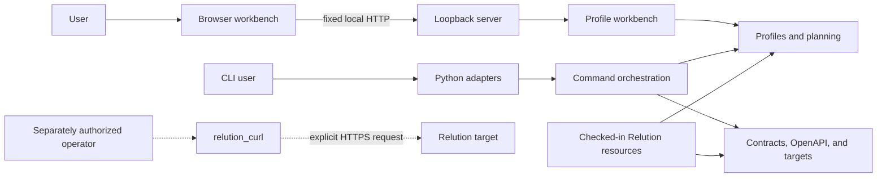
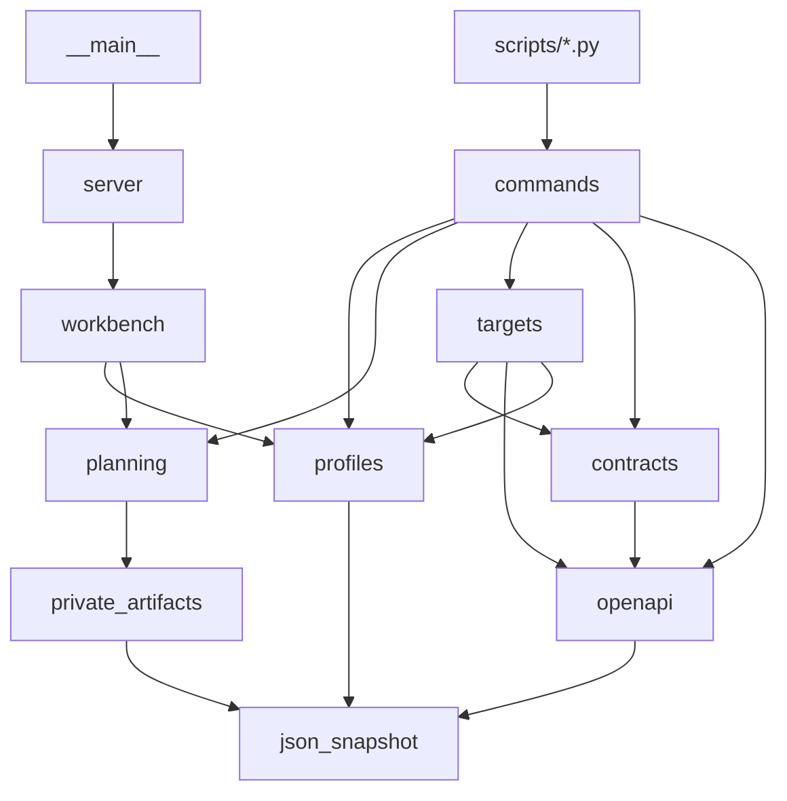

# Architecture

CampusWeave is a dependency-free, offline Python modular monolith with a
browser interface. Its checked-in data describes a synthetic university and a
Relution contract vocabulary; it does not describe or control a live tenant.

## System context

The dotted transport path is not part of the CampusWeave runtime. Nothing in
the browser, server, planner, or Python commands invokes it.

## Components

- `json_snapshot.py` owns strict, bounded JSON snapshots. It rejects duplicate
  keys, non-finite values, symlinks, wrong file types, oversize data, and
  unstable reads.
- `private_artifacts.py` owns canonical JSON, digesting, owner-only artifacts,
  private evidence roots, and create-only writes.
- `profiles/` validates the university profile and identity-only rebinding.
- `planning/` builds deterministic digest-bound plans with unbound steps.
- `openapi/` parses supported Swagger/OpenAPI JSON and renders deterministic
  Markdown and JSON catalogs. It has no CLI parser.
- `contracts/` validates registries, catalogs, bindings, and change plans.
- `targets/` validates private digest-bound evidence without granting authority
  or selecting operations.
- `workbench.py` contains pure reference-profile use cases.
- `server.py` owns fixed loopback HTTP, request limits, security headers, and
  the static-file allowlist.
- `commands/` owns CLI parsing, messages, exit codes, catalog writes/checks,
  and machine-document orchestration.
- `resources.py` is the only owner of repository resource locations.
- `web/` owns browser state, same-origin API access, rendering, downloads, and
  local profile persistence.

## Dependency direction

Dependencies point from adapters and transports toward capabilities. The exact
allowed Python edges are enforced by `tests/test_architecture.py`, which also
rejects cycles, dynamic product imports, `sys.path` mutation, domain CLI
parsers, and Python adapter imports outside `campusweave.commands`.

## Runtime flows

### Browser workbench

`campusweave.__main__` starts `127.0.0.1:8766`. The server accepts two fixed
GET API routes and three fixed POST routes, plus allowlisted static files. It
rejects unexpected hosts and origins, query strings, other methods, malformed
or duplicate-key JSON, non-JSON content, and request bodies over 2 MiB.

The browser uses same-origin requests without credentials and without caching.
`workbench.py` validates the reference profile or an exact identity-only
rebinding, compiles a plan, and returns counts, digests, and dry-run facts.
There is no server-side mutable application state.

### Offline commands

The runtime adapter delegates to `commands.runtime` for profile, plan, target,
and contract operations. Plan compilation precedes target validation. Plans
are deterministic, bound to the canonical profile digest, and contain only
unbound abstract intent. A successful dry run reports no network or mutation
calls and both execution flags false.

The catalog adapter parses caller-supplied JSON, enumerates supported operation
surfaces, and writes or checks paired deterministic catalogs. The machine-doc
adapter validates checked-in or caller-supplied registries, catalogs, bindings,
and change plans. Neither adapter fetches a contract.

### Private target evidence

An evidence-bound target context ties one profile, origin, organization,
OpenAPI document, generated catalog, binding set, and inventory snapshot to
their digests beneath a private evidence root. Directories require mode `0700`
and files require mode `0600`; traversal, symlinks, hard links, unstable reads,
and credential-bearing content are rejected. Operation roles remain
`operator_asserted_unproven`, so successful validation cannot choose or
authorize a request.

## State and configuration

The application has no environment-file loader, database, migration layer,
background worker, deployment configuration, or mutable server-side store. Its
authoritative public inputs are located through `resources.py` under
`docs/relution/` and `web/`.

The browser keeps transient UI state in memory and one validated profile in
local storage under `campusweave:v1:profile`, bounded to 2 MiB. Target exports,
catalogs, plans, and evidence are local operator artifacts and must remain
outside the tracked tree, normally below ignored `.local/` paths.

## Build and deployment boundary

Setuptools exposes one `campusweave` console script, and the frontend is native
ES modules served directly from the source checkout. The package configuration
does not declare the `web/` or `docs/relution/` resources as wheel data, so a
wheel alone is not a claimed complete runtime distribution. There is no
container, service-manager, deployment, migration, or release automation.

## Invariants and non-goals

- Normal flows remain offline, credential-free, loopback-only, deterministic,
  and non-authorizing.
- Private filesystem protection fails closed rather than weakening for
  portability.
- The checked-in catalog remains a `not_generated` placeholder; target-derived
  catalogs stay private.
- The server exposes only fixed routes and allowlisted assets.
- Runtime v1 does not execute, publish, assign, synchronize, retry, resume,
  audit, or roll back a live operation.
- Live transport is an independent operator responsibility described in
  [the Relution operations runbook](relution/OPERATIONS.md).

See [Using CampusWeave](USAGE.md) for user workflows and
[Frontend development](FRONTEND.md) for browser module and accessibility rules.
