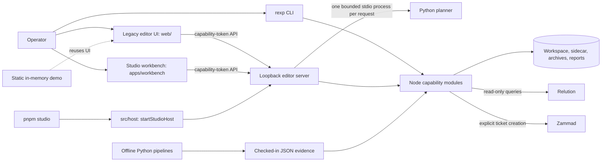
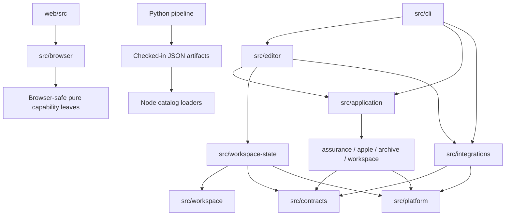

# Architecture

REXP Studio is a local policy-engineering workbench. It reads Relution policy
archives and plaintext workspaces, evaluates them against bundled policy and
device-management catalogs, supports local editing and remediation, and emits
verified archives, Apple artifacts, and audit reports.

The repository is a modular monolith. The Node CLI and loopback HTTP server run
in one local process, the React application is an HTTP client of that process,
and the Python pipelines are offline producers of checked-in recommendation
artifacts. These are runtime and artifact boundaries, not separate services.

## System context

The operational editor is the CLI-started Node process plus its React client.
In the monorepo, `src/host/` composes the same loopback server for Relution
Policy Studio: it serves the built workbench as a static root, owns the private
project store and invokes the Python planner over versioned JSON stdio (see
[decision 0006](decisions/0006-unified-node-python-host.md)). `rexp serve` and
`rexp edit` keep serving the legacy editor UI from `dist-web/`.
The demo build (`pnpm build:demo`, built and verified by the root `pnpm verify`
gate) is an isolated in-memory demo and has no filesystem, archive, credential,
Relution, Zammad, or product API authority. GitHub Pages deployment is not
configured in this monorepo.

## Runtime boundaries

- The `rexp` CLI owns command parsing, process output, exit status, and starting
  the loopback editor.
- The editor server owns local authority, request limits, route matching, HTTP
  status mapping, and access to filesystem and service adapters.
- Application use cases coordinate multi-effect workspace, archive, compliance,
  Relution, and Zammad workflows without depending on HTTP request or response
  objects. Routes may call pure capability functions directly when no workflow
  coordination or effect boundary is involved.
- The React application owns transient editing and presentation state. It uses
  the loopback API for durable mutations and imports server-side code only
  through `src/browser/`.
- Python tools under `tools/` harvest and normalize offline evidence. The Node
  runtime consumes their checked-in JSON outputs and never imports Python code.

## Package entry points

Other monorepo packages may use only the entry points declared in
`package.json` `exports`; the root `tools/check-boundaries.mjs` rejects relative
imports that leave an app and imports of another app's build output.

| Entry point | Target | Consumers |
| --- | --- | --- |
| `rexp-studio/host` | `dist/src/host/index.js` | Root launcher (`pnpm studio`) |
| `rexp-studio/testing` | `dist/src/host/testing.js` | Root integration tests only |
| `rexp-studio/browser` | `src/browser/index.ts` (TypeScript source) | Bundled browser code |
| `rexp-studio/ui` | `web/src/studio-ui.ts` (TypeScript source) | Workbench (editor controller and field editors) |

`browser` and `ui` export TypeScript source for bundler consumers; Node
consumers use the built `host` and `testing` entries. The legacy UI keeps its
internal imports and never imports `studio-ui.ts`, so its bundle budget is
independent of the workbench.

## Source ownership

| Path | Responsibility |
| --- | --- |
| `src/contracts/` | Shared pure DTOs and schema shapes with no higher-layer dependencies |
| `src/application/` | Transport-independent orchestration and narrow effect ports |
| `src/archive/` | `.rexp` and ZIP format handling, cryptography, and verification |
| `src/workspace/` | Lossless workspace document model, validation, and policy mutations |
| `src/workspace-state/` | Durable workspace plus editor-sidecar unit of work |
| `src/assurance/` | Recommendations, baselines, templates, compliance, and audits |
| `src/apple/` | Apple schema, compatibility, profile, and plist behavior |
| `src/editor/` | Loopback HTTP runtime, authority, routes, and HTTP-facing integration adapters |
| `src/integrations/` | Relution and Zammad protocol clients, the planner stdio client, and durable operation behavior |
| `src/platform/` | Bounded filesystem, HTTP, network, and serialization primitives |
| `src/browser/` | Browser-safe contracts and exact pure projections used by React |
| `src/cli/` | CLI parsing, dispatch, and command adapters |
| `src/host/` | Studio composition root (`rexp-studio/host`) and the integration-test entry (`rexp-studio/testing`) |
| `src/mdm/` | Deterministic LAB-only MDM validation and generation |
| `web/src/app/` | React composition root, navigation, and shared workspace shell |
| `web/src/shared/` | Small browser-only contracts shared by the app shell and product features |
| `web/src/features/` | Product capability UI and feature-owned state/actions |
| `web/src/ui/` | Reusable presentation controls with no product orchestration |
| `web/src/studio-ui.ts` | The editor controller and field editors exported to the workbench (`rexp-studio/ui`) |
| `tools/` | Offline Python pipelines plus developer/build entry points |
| `tests/` | Focused contract, integration, security, unit, and Python checks |

`src/cli.ts` is the only root source file and executable composition entry.
Capability modules are internal implementation, not a separately published
programmatic package API.

## Dependency direction

Interfaces are used for nondeterministic effects such as persistence, archive
publication, and HTTPS. Pure mapping, validation, parsing, and formatting code
uses direct functions rather than wrapper interfaces.

Editor routes use the `workspace-state` editor port for durable workspace and
sidecar state. The state-initialization adapter is the only editor-owned code
permitted to use raw state persistence; all archive imports and builds go
through the port and application use cases where they coordinate multiple
effects.

The React app layer is the composition root: it selects product features,
passes feature inputs, and owns routing and the shared workspace shell. Each
directory immediately under `web/src/features/` is an isolated feature
package. A feature may use its own files, `web/src/ui/`, `web/src/shared/`, and
the browser-safe server boundary, but it must not import a sibling feature or
the app shell. Cross-feature contracts and small browser-only utilities belong
in `web/src/shared/`; application composition remains in `web/src/app/`.
Reusable UI likewise does not import product feature orchestration. The
`settings` feature owns theme definitions, persistence, contrast validation,
DOM application, and theme controls. The app may hold the selected theme while
composing the settings feature, but theme implementation does not leak into a
sibling feature.

The architecture check enforces an acyclic capability graph. Integrations do
not import the editor or application layer; HTTP parsing and status mapping live
under `src/editor/integrations/`, while protocol clients remain under
`src/integrations/`.

## Durable state and side effects

After authentication and origin checks, each mutation domain admits at most 32
requests and reserves at most 65 MiB using the routes' body limits. Up to two
JSON bodies are read concurrently; state effects execute one at a time. Bodyless
routes skip body reading. Reservations remain held until execution finishes, and
disconnects cancel only work whose state effect has not started.

The managed workspace surface is `metadata.json`, `report.json`, and
`policies/policy_*.json`. `editor-sidecar.json` is editor-only state and is not
packed into `.rexp` archives. A private journal and inter-process lock publish
the workspace and sidecar as one recoverable unit. Recovery runs before every
load or mutation and retains the existing path, symlink, size, and private-mode
checks.
Mutations keep the privately loaded previous state for rollback, clone the
mutator's input once, and reload the canonical published state before returning.

Archive output is deliberately outside that transaction because it may be on a
different filesystem. Building captures one locked workspace-and-sidecar pair
into a private packing source, validates and stages that exact source, then
publishes the archive atomically with the captured sidecar as its associated
response. A concurrent live-workspace mutation cannot change that build. The
build never republishes source state, and a crash cannot be described as atomic
across both filesystems.
The internal staging packer omits the ordinary packer's in-memory self-check;
verification of the written staging file remains mandatory before publication.

Forced archive extraction has its own private phase journal. It recovers an
interrupted destination replacement before the next extraction and retains the
prior directory until the new directory and parent entry are durable.

Relution remains read-only. Zammad ticket creation is the only supported remote
write and remains a separate idempotent operation aggregate with durable
reconciliation. Neither belongs inside the workspace transaction.

## External contracts

The stable contracts are the `rexp` command surface, authenticated loopback HTTP
API, `.rexp` format, plaintext workspace shape, sidecar version, generated LAB
MDM manifest, read-only Relution request allowlist, and explicit Zammad ticket
workflow. Internal file paths and route helper composition are not compatibility
contracts.

## Mechanical checks

`pnpm check:architecture` rejects TypeScript dependency cycles, browser imports
that bypass `src/browser/`, capability-level cycles or forbidden dependency
directions, non-owner editor imports of raw workspace persistence, Node
dependencies reachable from browser runtime code, numbered Python split modules,
wildcard Python imports, internal Python imports through public tool facades,
reusable UI imports of feature orchestration, feature imports of the app shell,
and imports between sibling feature packages.

`pnpm check:architecture -- --self-test` exercises the editor-persistence and
frontend isolation rules against allowed and forbidden imports.
`pnpm verify:ci` combines the architecture check with type checking, builds, bundle budgets, Node contract tests, Ruff, and Python pipeline
tests. Dead-code analysis (`knip`) runs from the monorepo root in workspace
mode together with the workbench.

The active safety and structural rationale is recorded in
[`docs/decisions/`](decisions/README.md). The independently maintained LAB MDM
artifact contract is documented in [`mdm/README.md`](../mdm/README.md).
